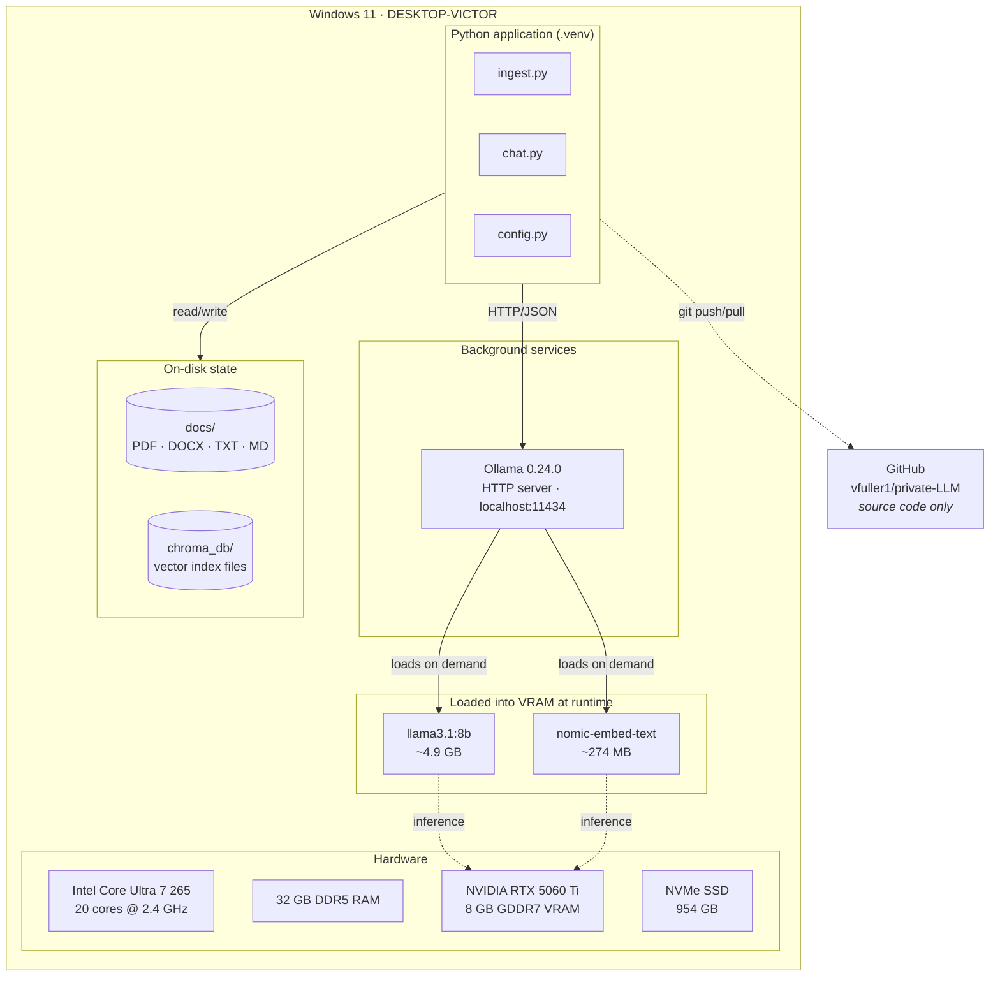
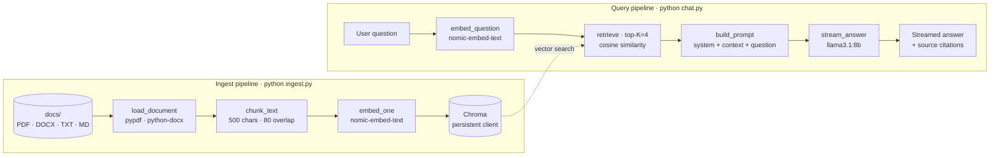

# Architecture — Ask My Docs (private-LLM)

A fully local, document-aware AI assistant. All inference, embedding, and
retrieval happen on a single Windows workstation — no API keys, no cloud,
no data leaves the machine.

---

## TL;DR

| | |
|---|---|
| **What** | A RAG (Retrieval-Augmented Generation) app that answers questions about my own documents. |
| **Where** | Runs entirely on one Windows PC (DESKTOP-VICTOR, RTX 5060 Ti, 32 GB RAM). |
| **Stack** | Ollama · Llama 3.1 8B · nomic-embed-text · Chroma (file-based) · Python 3.14. |
| **Data path** | docs (PDF/DOCX/TXT/MD) → chunk → embed → vector store → top-K retrieval → LLM. |
| **Privacy** | No external calls. Source code is the only thing that touches GitHub. |

---

## Why I built it

I wanted to learn how private LLMs actually work — not from a tutorial walkthrough,
but by building each piece myself. The goals were:

1. **Understand RAG from the ground up.** Every enterprise LLM project I read about
   uses some flavor of retrieval-augmented generation. Rather than start with a
   framework like LangChain or LlamaIndex, I wanted to write the chunking, embedding,
   retrieval, and prompting code by hand so I'd know exactly what's happening at
   every step.
2. **Validate that "private LLM" is actually achievable on a single PC.** Most
   coverage of private LLMs assumes a data-center GPU. I wanted to prove that a
   modest gaming GPU (RTX 5060 Ti, 8 GB VRAM) is enough to run a useful model
   and serve real workloads.
3. **Build something I'd actually use.** A searchable, queryable version of my
   own notes, reports, and reference PDFs that I can keep extending.

---

## Physical architecture

What's actually running on the machine, and where each piece lives.



**Key boundaries.**

- Nothing on this diagram crosses the network except `git push/pull`, and that
  only carries source code — never documents, prompts, or model output.
- Ollama runs as a background service the moment Windows boots. The Python app
  talks to it over `localhost:11434` using a tiny HTTP/JSON protocol — no
  sockets to manage, no model loading to coordinate.
- The 8 B parameter model fits comfortably in the RTX 5060 Ti's 8 GB of VRAM,
  with room for the embedding model and the KV cache. GPU utilization during
  inference sits around 70–95%.

---

## Logical architecture

The data flow, decoupled from the hardware. Two pipelines: one offline (ingest),
one online (query).



**How the two pipelines fit together.**

Ingest runs whenever documents change. It's wipe-and-rebuild rather than
incremental — simple to reason about, and fast enough for personal-scale data
(seconds for dozens of docs).

Query runs every time the user asks something. It uses the *same embedding model*
as ingest — this is critical, because the question vector and the chunk vectors
must live in the same vector space for cosine similarity to be meaningful.

---

## How it works, step by step

### Ingest pipeline (`ingest.py`)

1. **Load.** Walk `docs/`, dispatch each file to the right loader by extension:
   `pypdf` for PDFs, `python-docx` for Word, plain read for `.txt`/`.md`.
2. **Chunk.** Slide a 500-character window across the text with 80 characters of
   overlap. Overlap matters: it prevents a sentence containing the answer from
   being split exactly in half between two chunks.
3. **Embed.** Call Ollama's embeddings API for each chunk:
   `POST /api/embeddings` → 768-dimensional vector. The `nomic-embed-text`
   model is small (~270 MB), fast (~5 ms per chunk on the GPU), and produces
   semantically meaningful vectors — pieces of text with similar meaning end
   up pointing in similar directions.
4. **Store.** Write `(id, document, metadata, embedding)` tuples into a Chroma
   collection. Chroma's persistent client just writes SQLite + parquet files to
   `chroma_db/` — no separate database process to run.

### Query pipeline (`chat.py`)

1. **Embed the question** with the *same* embedding model used at ingest.
2. **Retrieve.** Ask Chroma for the top-K (default 4) chunks whose embeddings
   are nearest the question vector. Chroma handles the index internally —
   it uses HNSW under the hood, which is sub-linear in the number of chunks.
3. **Build the prompt.** Stuff the retrieved chunks into a template that
   instructs the LLM to answer using *only* the provided context, and to say
   "I don't know" if the answer isn't there. This grounding is what makes RAG
   resistant to hallucination.
4. **Generate.** Stream tokens back from `llama3.1:8b` via Ollama's chat API
   (`POST /api/chat` with `stream=true`). Tokens print to stdout as they arrive,
   so responses feel responsive even on the first generation.
5. **Cite.** Print the source filename and chunk index for every retrieved
   chunk so the user can verify the answer.

---

## Tech choices and trade-offs

| Choice | Why | Trade-off |
|---|---|---|
| **Ollama** as the model runtime | One-click install on Windows, handles GPU detection and model lifecycle, simple HTTP API. | Less control than `llama.cpp` directly; can't fine-tune through Ollama (yet). |
| **Llama 3.1 8B** | Sweet spot for an 8 GB GPU. Strong reasoning, broad knowledge, instruction-following. | Knowledge cutoff is older than frontier closed models; can be beaten on hard reasoning by Qwen 2.5 14B. |
| **nomic-embed-text** | High-quality open embeddings, runs locally, only ~270 MB. | English-centric; multilingual content would benefit from `mxbai-embed-large` or `bge-m3`. |
| **Chroma (persistent client)** | Zero-ops vector DB — just files on disk. Good API. Works perfectly at personal scale. | Not great beyond ~1M vectors; for production you'd reach for Qdrant, Weaviate, or pgvector. |
| **Hand-rolled chunking** | Transparent, easy to tune, no framework lock-in. | A real RAG system benefits from semantic / recursive chunking (e.g. via LangChain's `RecursiveCharacterTextSplitter`). |
| **No framework** (no LangChain / LlamaIndex) | I wanted to *understand* RAG, not glue together someone else's abstractions. | More code to maintain if this grows. |
| **CLI interface** | Simplest possible UI to verify the pipeline. | Not portable to non-technical users; a Gradio or FastAPI front-end is one of the next features. |

---

## Code structure

```
private-LLM/
├── README.md                  ← setup walkthrough
├── ARCHITECTURE.md            ← this document
├── requirements.txt           ← ollama, chromadb, pypdf, python-docx
├── config.py                  ← models, paths, chunk size, top-K
├── ingest.py                  ← offline pipeline (load → chunk → embed → store)
├── chat.py                    ← online pipeline (embed → retrieve → generate)
├── .gitignore                 ← excludes .venv, chroma_db, __pycache__
├── docs/                      ← user documents (mostly gitignored)
│   └── sample_private_llms.txt
└── chroma_db/                 ← generated; rebuild with `python ingest.py`
```

The whole project is under ~250 lines of Python. Each file has a single
responsibility, which makes it easy to swap in alternatives — for example,
replacing Chroma with FAISS only requires changing about 15 lines of
`ingest.py` and `chat.py`.

---

## Performance notes

Measured on the target machine (RTX 5060 Ti 8 GB, Core Ultra 7 265, 32 GB RAM):

- **Cold-start latency.** First question after `python chat.py` takes ~10–20 s
  because the 8 B model has to load into VRAM. Subsequent questions stream
  tokens in well under a second to first token.
- **Embedding throughput.** ~5 ms per chunk for `nomic-embed-text`. Indexing
  100 PDF pages (~600 chunks) takes about 4 seconds.
- **Generation speed.** Roughly 60–90 tokens/sec on the 8 B model, fully in
  VRAM. Streaming makes this feel instant.
- **Memory footprint.** Ollama uses ~5 GB of VRAM with the model loaded.
  Chroma + Python use ~500 MB of system RAM at rest. Plenty of headroom
  for a 14 B model if I want to upgrade.

---

## What I'd do next

Roughly in order of value-to-effort ratio:

1. **Gradio web UI.** Wrap `answer_question()` in a Gradio interface — about
   10 lines of code, makes the project usable for non-technical people.
2. **Incremental ingest.** Hash each file, only re-embed changed ones.
   Speeds up updates and avoids re-embedding 1000-page PDFs for a one-line edit.
3. **Reranking.** Add a second-stage cross-encoder reranker (e.g.
   `BAAI/bge-reranker-base`) on top of the top-K vector search results.
   Significantly improves retrieval quality.
4. **Hybrid search.** Combine vector similarity with keyword (BM25) scoring —
   helps with proper nouns, codes, and dates that embeddings sometimes miss.
5. **Structured output mode.** Use Ollama's JSON mode to extract entities,
   dates, action items, or summaries with guaranteed schemas.
6. **Multi-collection support.** Today everything goes into one collection;
   splitting by source type (e.g. "personal", "research", "code") lets the
   user scope a question.
7. **Eval harness.** A small set of (question, expected answer, expected
   sources) tuples so I can measure whether a model swap or prompt change
   actually improved things.

---

## What I learned

- **RAG is mostly plumbing, but the plumbing matters.** Chunk size, overlap,
  top-K, and the prompt template each have outsized effects on answer quality.
  Worth tuning explicitly rather than copying defaults.
- **Streaming changes UX more than it should.** Even a token-per-second model
  feels usable when streaming; a faster model that batches the whole answer
  feels slow.
- **8 GB of VRAM is more than enough** for a daily-driver private LLM. The
  industry narrative that you need an A100 to run useful local models is wrong
  — it was true two years ago, not in 2026.
- **Avoiding frameworks early was the right call.** I now know exactly what
  LangChain/LlamaIndex actually do under the hood, which means I can pick them
  up later with no mystery.
