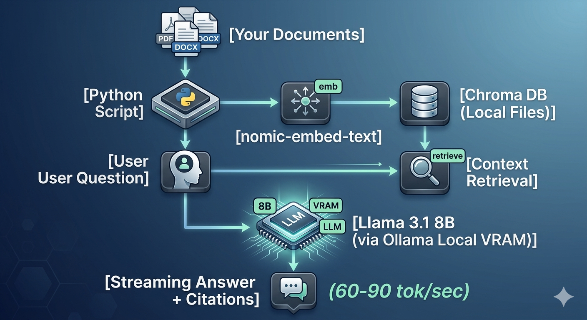

# private-LLM
 


A fully local, document-aware AI assistant. The language model, the embeddings,
and the vector database all run on one workstation — no API keys, no cloud
calls, no data leaving the host. Includes a question-answering chat interface
and an interactive quiz generator built on the same RAG pipeline.

> **Built and run on:** Windows 11 · NVIDIA RTX 5060 Ti (8 GB) · 32 GB RAM
> **Stack:** Ollama · Llama 3.1 8B · nomic-embed-text · Chroma · Python 3.14
> **Lines of application code:** ~400 across `ingest.py`, `chat.py`, `quiz.py`, `config.py`

---

## What it does

- **Chat with your documents.** Drop PDFs, Word files, text, or markdown into
  `docs/`, run one command to index them, then ask natural-language questions
  and get streamed answers with citations.
- **Generate timed multiple-choice quizzes** on any topic in the corpus. The
  local LLM writes the questions in JSON, the script administers and scores
  the quiz, and explanations cite the source chunk.
- **Stay private.** Source code is the only thing that touches the network —
  via `git push/pull`. Prompts, documents, and model output never leave the
  machine.

 

## Why it exists

The project demonstrates that a credible private RAG system can be built and
operated on commodity hardware, without managed services, without paying per
token, and without leaking sensitive material to a third party.

It also proves out the full RAG pipeline by hand — chunking, embedding,
retrieval, prompt construction, generation — rather than gluing together
framework abstractions. See [`ARCHITECTURE.md`](ARCHITECTURE.md) for a
walkthrough including physical and logical diagrams.

## What this project demonstrates

- **End-to-end RAG implementation** — chunking strategy, embedding pipeline,
  vector search, prompt grounding, citation enforcement.
- **Local model orchestration** — Ollama-based inference, GPU-aware model
  selection, streamed token output.
- **JSON-mode structured generation** — quiz generator constrains the LLM's
  output schema and parses it for an interactive experience.
- **Practical document handling** — robust loaders for PDF, DOCX, TXT, MD,
  including DOCX tables.
- **Operational readiness** — sensible defaults, configurable knobs, clear
  separation of ingest vs serve, deterministic re-indexing, gitignored
  state directories.

## Architecture at a glance

```
┌───────────────────────┐                ┌───────────────────────┐
│  Ingest pipeline      │                │  Query pipeline       │
│  python ingest.py     │                │  python chat.py       │
│                       │                │  python quiz.py       │
│  docs/ ─► load ─►     │                │  question ─► embed ─► │
│  chunk ─► embed ─►    │  ───► Chroma ◄───  retrieve ─► prompt ─►│
│  store                │   vector store │  stream answer        │
└───────────────────────┘                └───────────────────────┘
                            (all on one host, no network)
```

Full diagrams (Mermaid, rendered natively on GitHub) are in
[`ARCHITECTURE.md`](ARCHITECTURE.md).

## Quick start

Requires Python 3.10+ and [Ollama](https://ollama.com/download).

```powershell
# Pull the models
ollama pull llama3.1:8b
ollama pull nomic-embed-text

# Set up the project
git clone https://github.com/vfuller1/private-LLM.git
cd private-LLM
python -m venv .venv
.venv\Scripts\Activate.ps1     # macOS/Linux: source .venv/bin/activate
pip install -r requirements.txt

# Index the bundled knowledge base
python ingest.py

# Ask questions
python chat.py

# Or take a quiz
python quiz.py
```

## Demo — chat

```
Ask My Docs (model: llama3.1:8b) — type 'quit' to exit.

You: What's the difference between HNSW and IVF?
Assistant: HNSW (Hierarchical Navigable Small World) is a graph-based
approximate nearest-neighbor algorithm that builds a multi-layer graph and
greedily walks toward the query — it offers very high recall at low latency
but is memory-heavy. IVF (Inverted File index) clusters all vectors using
k-means and searches only the nearest clusters at query time — it's faster
to build and more memory-efficient, but recall depends on the `nprobe`
parameter. IVF is often combined with Product Quantization (IVF-PQ) for
aggressive compression at scale.
Sources:
  - vector_search.md (chunk 6)
  - vector_search.md (chunk 7)
```

## Demo — quiz

```
$ python quiz.py --topic "AI governance" --n 3

Generating 3 questions on: AI governance
(retrieving relevant chunks + asking the local LLM — please wait)

Ready — 3 questions. Type 'q' anytime to quit.
--------------------------------------------------

Question 1/3
Which of the following is classified as "unacceptable risk" under the EU AI Act?
  A. Chatbots that disclose AI involvement
  B. AI used in credit scoring
  C. Real-time biometric identification in public spaces
  D. Foundation models with under 10²⁵ training FLOPs
Your answer (A/B/C/D, or 'q' to quit): C
  ✓ Correct.
  Explanation: The EU AI Act bans real-time biometric ID in public spaces
  outright (with narrow exceptions), placing it in the "unacceptable risk"
  tier alongside social scoring and manipulative AI.

...
==================================================
Quiz complete — Topic: AI governance
Score: 3/3  (100%)
Source documents:
  - ai_governance.md
==================================================
```

## Project layout

```
private-LLM/
├── README.md              project overview (this file)
├── ARCHITECTURE.md        physical and logical diagrams, design rationale
├── requirements.txt       ollama, chromadb, pypdf, python-docx
├── config.py              models, paths, chunk size, top-K
├── ingest.py              offline pipeline: load → chunk → embed → store
├── chat.py                online pipeline: embed → retrieve → generate
├── quiz.py                quiz generator + interactive runner
├── docs/                  ingestion corpus
│   ├── ai_governance.md
│   ├── rag.md
│   ├── mcp.md
│   ├── embeddings.md
│   ├── chunking.md
│   ├── agent_architecture.md
│   └── vector_search.md
└── chroma_db/             generated; rebuilt by `python ingest.py`
```

## Configuration

All tunable parameters live in `config.py`:

| Setting | Default | Notes |
|---|---|---|
| `LLM_MODEL` | `llama3.1:8b` | Any Ollama-served chat model. |
| `EMBED_MODEL` | `nomic-embed-text` | Must match across ingest and query. |
| `CHUNK_SIZE` | `500` | Characters per chunk. |
| `CHUNK_OVERLAP` | `80` | Characters of overlap between chunks. |
| `TOP_K` | `4` | Retrieved chunks per query. |
| `COLLECTION_NAME` | `ask_my_docs` | Chroma collection identifier. |

Models that fit well on an 8 GB GPU and outperform the default in specific
tasks: `qwen2.5:7b` (reasoning), `qwen2.5:14b` (mixed VRAM+RAM, smarter),
`phi4` (14B, strong technical), `mistral` (general purpose).

## Performance

Measured on the target machine (RTX 5060 Ti 8 GB, Core Ultra 7 265, 32 GB RAM):

- **Cold-start latency:** ~10–20 s on the first question (model loads into VRAM).
- **Streamed generation:** 60–90 tokens/sec on Llama 3.1 8B.
- **Embedding throughput:** ~5 ms per chunk; 600 chunks in ~4 s.
- **Resident VRAM:** ~5 GB with the model loaded.

## Roadmap

Planned extensions, roughly in value-to-effort order:

1. Gradio web UI for chat and quiz.
2. Incremental ingest (hash files, skip unchanged content).
3. Two-stage retrieval with a cross-encoder reranker.
4. Hybrid search (vector + BM25) for keyword-sensitive queries.
5. Multi-collection support with per-collection access scopes.
6. Eval harness — ground-truth (question, answer, source) tuples and
   automated regression on model/config changes.
7. Structured-extraction mode (entities, dates, action items) using
   Ollama's JSON-output feature.

## License

MIT.
